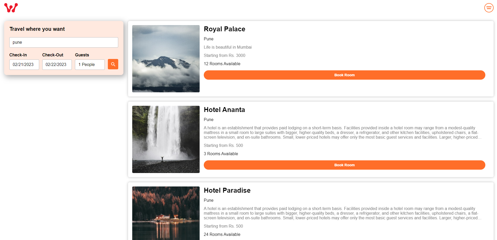

<h1 align="center">Hotel Booking Web App</h1>
<p align="center">
  A full-featured hotel booking web app built using the MERN Stack. <br />
  <a href="https://hotel-booking-web-app.vercel.app/">Live Demo</a>
  ·
  <a href="https://github.com/DebjitPramanick/Hotel-Booking-Web-App/issues">Report Bug</a>
  ·
  <a href="https://github.com/DebjitPramanick/Hotel-Booking-Web-App/issues">Request Feature</a>
</p>

---

## 📑 Table of Contents

<details open="open">
  <summary>Click to expand</summary>
  <ol>
    <li>
      <a href="#about-the-project">About The Project</a>
      <ul>
        <li><a href="#features">Features</a></li>
        <li><a href="#built-with">Built With</a></li>
      </ul>
    </li>
    <li>
      <a href="#getting-started">Getting Started</a>
      <ul>
        <li><a href="#prerequisites">Prerequisites</a></li>
        <li><a href="#installation">Installation</a></li>
      </ul>
    </li>
    <li><a href="#usage">Usage</a></li>
    <li><a href="#roadmap">Roadmap</a></li>
    <li><a href="#contributing">Contributing</a></li>
    <li><a href="#contact">Contact</a></li>
  </ol>
</details>

---

## 📝 About The Project


A powerful hotel booking application that allows users to search, book, and manage hotel reservations. Hotel managers can create, update, and remove listings, while admins have full control over the system.

### ✨ Features
- User authentication (Login/Register)
- Search and filter hotels by price, location, and amenities
- Secure payment integration using Stripe
- Hotel management dashboard for owners
- Admin panel for full system control
- Responsive UI with a modern design

### 🔧 Built With
* [React](https://reactjs.org/)
* [Node.js](https://nodejs.org/en/)
* [Express.js](https://expressjs.com/)
* [GraphQL](https://graphql.org/)
* [MongoDB](https://www.mongodb.com/)
* [Stripe](https://stripe.com/en-in)

---

## 🚀 Getting Started

Follow these steps to set up the project locally.

### 🖥️ Prerequisites

Ensure you have the following installed:
* [Node.js & NPM](https://nodejs.org/en/)
* [MongoDB](https://www.mongodb.com/)

### 🛠️ Installation

1. Clone the repository:
   ```sh
   git clone https://github.com/DebjitPramanick/Hotel-Booking-Web-App.git
   ```
2. Navigate to the project directory:
   ```sh
   cd Hotel-Booking-Web-App
   ```
3. Start MongoDB and create a database.
4. Copy the MongoDB connection URL and add it to a `.env` file as `MONGO_URL`.
5. Install backend dependencies and start the server:
   ```sh
   cd server
   npm install
   nodemon server.js
   ```
6. Open a new terminal and install frontend dependencies:
   ```sh
   cd client
   npm install
   npm start
   ```

---

## 📌 Usage

Login Credentials:
- **Email:** admin2023@gmail.com
- **Password:** 1234



Explore the app and its features!

---

## 🤝 Contributing

Contributions are welcome! Follow these steps:
1. Fork the repository
2. Create a new feature branch (`git checkout -b feature/AmazingFeature`)
3. Commit your changes (`git commit -m 'Add some AmazingFeature'`)
4. Push to the branch (`git push origin feature/AmazingFeature`)
5. Open a Pull Request
